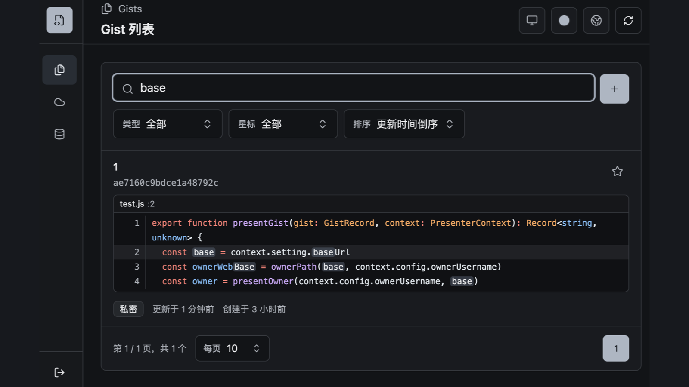
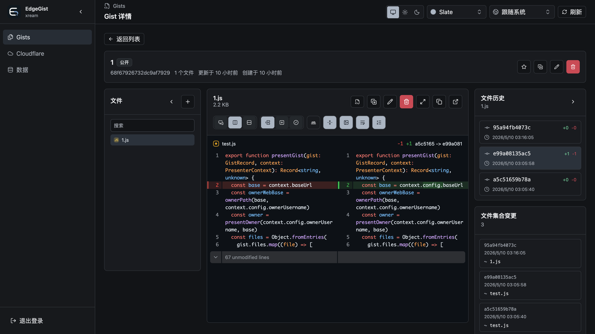
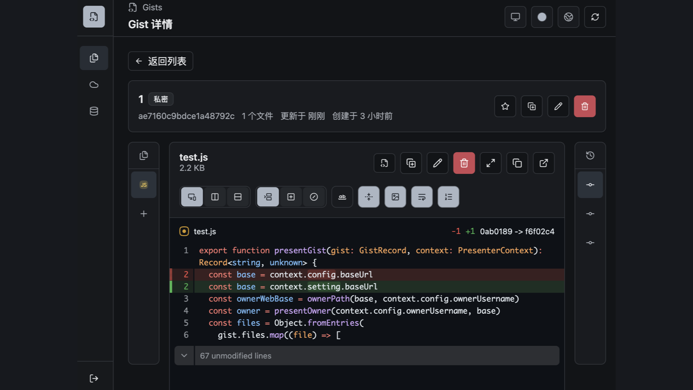
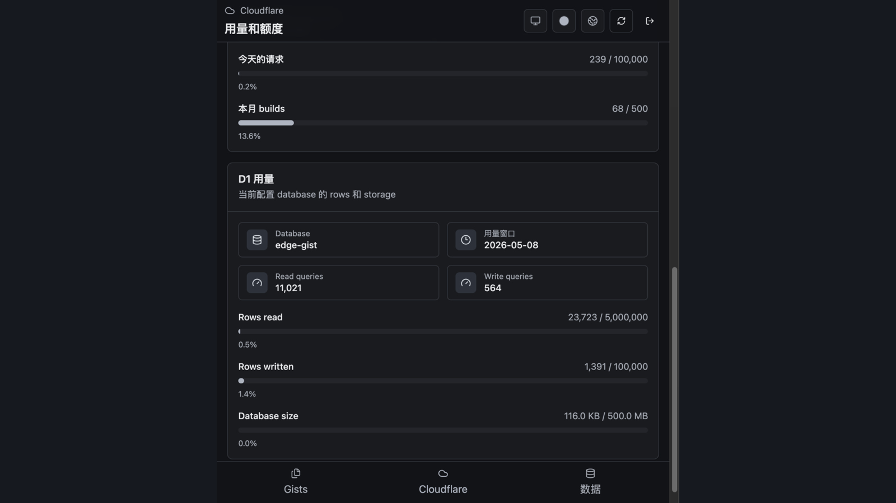
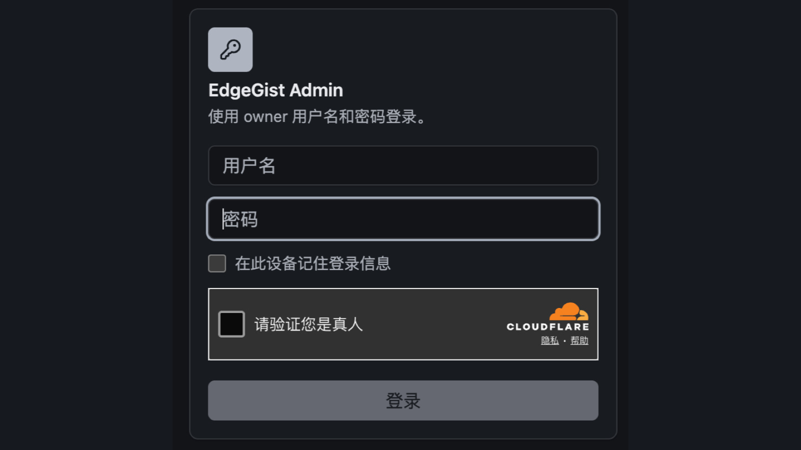

# EdgeGist

<p align="center">
  <picture>
    <source media="(prefers-color-scheme: dark)" srcset="public/icons/edgegist-dark-192.png">
    
  </picture>
</p>

[English](README.md)

EdgeGist 是一个运行在 Cloudflare edge network 上的 GitHub Gist API 兼容服务，使用 D1 存储，并打包为 Cloudflare Pages 项目。

能与 [Sub-Store](https://github.com/sub-store-org/Sub-Store) 的 Gist 分享和备份功能完美配合。

它的目标是 API-first：部署后配置自己的 owner token，把支持自定义 API base URL 的 Gist 客户端从 `https://api.github.com` 换成你的 EdgeGist 地址即可使用。同时它也提供 `/<owner>` 单 owner Web UI，用于浏览、编辑、导入导出和查看 Cloudflare 用量。根路径 `/` 会有意返回 `404`，不会自动跳转，从而避免暴露已配置的 owner route。

## 社群

👏🏻 欢迎加入社群进行交流讨论

👥 群组 [折腾啥(群组)](https://t.me/zhetengsha_group) · 📢 频道 [折腾啥(频道)](https://t.me/zhetengsha)

## 界面截图

<table>
  <tr>
    <td width="50%" valign="top" align="center">
      
      <br>
      <sub>后端搜索 id、description、文件名和文件内容，支持筛选、排序、分页、star，以及带语法高亮的内容匹配片段。</sub>
    </td>
    <td width="50%" valign="top" align="center">
      
      <br>
      <sub>响应式 gist 详情 dashboard，包含文件树、语法高亮内容、文件历史、文件集合变更和可配置 diff。</sub>
    </td>
  </tr>
  <tr>
    <td width="50%" valign="top" align="center">
      
      <br>
      <sub>Diff view 支持当前和历史 raw URL、自动/split/unified/stacked 布局、行内变更模式、换行、行号、背景和未修改行折叠。</sub>
    </td>
    <td width="50%" valign="top" align="center">
      
      <br>
      <sub>缓存和可刷新的 Cloudflare Pages Functions、Pages build、D1 rows 和 D1 storage 用量。</sub>
    </td>
  </tr>
  <tr>
    <td width="50%" valign="top" align="center">
      
      <br>
      <sub>Owner 登录使用用户名/密码，支持记住登录状态，也可以启用 Cloudflare Turnstile。</sub>
    </td>
    <td width="50%" valign="top"></td>
  </tr>
</table>

## 当前范围

- GitHub Gist 形态的核心 CRUD API 和 retained revisions。
- 单 owner 认证：API 客户端使用 bearer token，Web UI 使用密码 + 可选 Turnstile + 签名 cookie。
- public 和 secret-link visibility。secret gists 不出现在匿名列表 API，但知道 URL 时仍可直达；历史版本跟随当前 gist visibility。
- D1 存储当前文件、历史版本快照和 settings。
- 每个文件和每个 gist 的文件变更列表都按最新 N 条保留。
- GitHub Gist 风格的 Web UI：`/<owner>`、`/<owner>/new`、`/<owner>/<gist_id>` 和 `/<owner>/<gist_id>/<sha>`；支持匿名查看公开 gist、owner 管理、gist 编辑、文件历史、diff view、star、导入导出、i18n、主题、PWA 安装，以及 Cloudflare usage/quota 页面。
- 根路径 `/` 返回 `404`，不会跳转到 owner route。匿名用户需要知道 `/<owner>` 才能浏览公开 gist。
- 单 owner star 支持；fork、comment 仍为兼容 mock，永远不保存真实社交数据。
- 面向 Cloudflare Pages 的 release packaging，包含 Direct Upload zip。

暂不包含：git repository transport、多用户协作、真实社交功能。

## API 行为说明

- Owner API 客户端应发送 `Authorization: Bearer <EDGEGIST_OWNER_TOKEN>`。
- 匿名列表 API 只返回 `public` gists。`secret` gists 不出现在匿名列表里，但知道 URL 或 gist id 时仍可匿名读取。
- 历史版本没有独立 visibility。如果当前 gist 可以通过直达 URL 读取，它的 retained revisions 也可以通过直达 URL 读取。
- `PATCH /gists/{gist_id}` 中，`null`、空 content、空文件 spec 都表示删除该文件。删除所有文件会删除整个 gist。
- Raw file endpoint 会以 `text/plain` 和 `nosniff` 返回内容，所以 HTML gist 文件会作为 inert text 展示。

## 开发

需要 Bun 和 Node.js 22 或更高版本。本仓库带有 `.node-version`，因为 Wrangler 需要较新的 Node runtime。如果你使用 mise，先执行一次 `mise install`，之后进入仓库时 shell 会自动切到项目指定的 Node 版本。

```sh
bun install
bun run dev
```

`bun run dev` 会准备本地环境、执行 local D1 migration，并在 `http://127.0.0.1:8787/` 启动 API、在 `http://127.0.0.1:8787/<owner>` 启动 Web UI。根路径 `/` 按设计返回 `404`。

首次运行时它会：

- 缺少 `wrangler.jsonc` 时，从 `wrangler.example.jsonc` 创建一份；
- 创建或补齐 `.dev.vars` 的本地开发默认值；
- 把 `EDGEGIST_BASE_URL` 设置为 `http://127.0.0.1:8787`；
- localhost/loopback dev host 下总是跳过 Turnstile，即使配置了 Turnstile keys；
- 把 local D1 数据持久化到 `.wrangler/state/v3`。

常用开发命令：

```sh
bun run dev:prepare
bun run dev:server
bun run test
bun run build
```

只想创建本地配置并执行 local D1 migration 时，用 `bun run dev:prepare`。local D1 已经准备好、只想重启服务时，用 `bun run dev:server`。`bun run build` 会把 client assets 和 Cloudflare Pages worker 输出到 `dist/`。

如果你在 schema 稳定前跑过旧开发版本，本地 D1 开始报错，可以删除 `.wrangler/state/v3` 后重新执行 `bun run dev:prepare`。EdgeGist 的源码 migration 只保留新安装需要的干净 schema，不保留兼容旧开发数据的迁移代码。

## 配置文件

仓库只提交 example 配置。你本地修改后的真实配置会被 git ignore。

```sh
cp wrangler.example.jsonc wrangler.jsonc
```

编辑 `wrangler.jsonc`：

- `name`: Cloudflare Pages project 名称。
- `EDGEGIST_OWNER_USERNAME`: API 响应里显示的 owner login。
- `EDGEGIST_OWNER_PASSWORD`: `/<owner>` owner Web UI 登录密码。
- `EDGEGIST_OWNER_TOKEN`: Gist API 客户端使用的 token，放在 `Authorization: Bearer ...`。
- `EDGEGIST_BASE_URL`: 你的部署地址。
- `EDGEGIST_HISTORY_MAX_VERSIONS`: 每个 gist 文件保留最新多少份历史，同时每个 gist 的文件变更记录保留最新多少条。默认 `100`。
- `EDGEGIST_TURNSTILE_SITE_KEY` 和 `EDGEGIST_TURNSTILE_SECRET_KEY`: 可选，用 Cloudflare Turnstile 保护 owner 登录表单。需要同时配置两个值；两个都留空则关闭 Turnstile。
- `database_id`: Cloudflare D1 database id。

不要提交 `wrangler.jsonc` 或 `.dev.vars`。

历史保留：

```jsonc
"EDGEGIST_HISTORY_MAX_VERSIONS": "100"
```

安全默认值：

- EdgeGist 会发送 `X-Robots-Tag: noindex, nofollow, noarchive`，HTML 中包含 `robots` meta，并提供 `robots.txt` 的 `Disallow: /`，避免搜索引擎索引 public、secret-link、raw 和 Web UI 页面。
- 根路径 `/` 返回 `404`，不会跳转到 `/<owner>`，避免访问者从首页发现已配置的 owner username。
- Turnstile 是可选功能。在 Cloudflare dashboard 创建 Turnstile widget，把 site key 和 secret key 填到上面的两个环境变量，然后重新部署。EdgeGist 会在 owner 登录表单显示 Turnstile，并在后端通过 Cloudflare Siteverify 校验 token 后才检查用户名和密码，随后用签名 session cookie 维护 owner UI 登录态。API 客户端仍然可以继续使用 Bearer owner token。来自 `localhost`、`127.0.0.1`、`0.0.0.0` 或 `[::1]` 的本地开发请求会始终跳过 Turnstile，这样 owner UI 在离线或没有 localhost Turnstile widget 的情况下也能使用。

PWA 行为：

- 安装 manifest 从 `/<owner>/manifest.webmanifest` 返回，`start_url` 和 `scope` 都限制在 `/<owner>`。
- Service worker 从 `/<owner>/edgegist-sw` 返回，只缓存静态前端资源和图标，不缓存 API 响应、raw 文件内容或渲染后的 gist 页面。

## 命令行部署

需要 Bun、Wrangler 和 Cloudflare 账号。

```sh
bun install
bun run db:create
```

这会创建名为 `edge-gist` 的 Cloudflare D1 database。把命令输出里的 D1 database id 填入 `wrangler.jsonc`，然后执行：

```sh
bun run db:migrate:remote
bun run build
bun run deploy
```

部署完成后，把 Pages URL 作为 Gist API base URL，把 `EDGEGIST_OWNER_TOKEN` 作为 token。

## Cloudflare 手动部署

适合不能本地 build 的用户。

1. 打开最新 GitHub Release。
2. 下载 `edgegist-upload.zip` 和 `edgegist-package.zip`。
3. 在 Cloudflare Dashboard 的 D1 页面创建名为 `edge-gist` 的 database。
4. 打开新建 D1 database 的 console，从 `edgegist-package.zip` 复制 `migrations/` 下所有 SQL 文件，并按文件名顺序执行。
5. 创建 Cloudflare Pages project，选择 Direct Upload，上传 `edgegist-upload.zip`。
6. 在 Pages settings 中添加上面列出的环境变量。
7. 在 Pages Functions settings 中添加 D1 binding，变量名填 `DB`，database 选择 `edge-gist`。
8. 如果 Cloudflare 在配置后要求重新部署，重新上传同一个 `edgegist-upload.zip`。

## 让 AI 帮忙部署

适合希望 AI coding agent 直接从本地仓库完成部署的用户。

1. 告诉 AI 你的 Cloudflare Pages project 名称、owner username，以及最终 base URL 或自定义域名。
2. 让 AI 生成 `EDGEGIST_OWNER_TOKEN` 和 `EDGEGIST_OWNER_PASSWORD`，或提供你自己的值。
3. 让 AI 执行 `wrangler login`；Cloudflare 浏览器授权由你自己完成。
4. 让 AI 创建 `edge-gist` D1 database、写入 `wrangler.jsonc`、执行 migration、build、deploy，并验证 `/<owner>`。
5. 如果使用自定义域名，在 Cloudflare Pages 中添加域名，并把 DNS 指向 Pages project。

不要把 Cloudflare 账号密码发给 AI。使用 Wrangler OAuth login，或使用权限尽量小的 Cloudflare API token。

### 用于部署的 Cloudflare Account API Token

Wrangler 可以用 OAuth 登录部署，也可以用 `CLOUDFLARE_API_TOKEN` 部署。长期部署凭据建议使用 Account API Token，不建议使用 User API Token。Account API Token 属于 Cloudflare account，更适合 CI/CD 和长期集成。

创建部署 token：

1. 打开 Cloudflare Dashboard > Manage Account > Account API Tokens。
2. 选择 Create Token。
3. 名称可以填 `edge-gist-deploy`。
4. 添加权限 `Account` > `Cloudflare Pages` > `Edit`。
5. Account Resources 只选择拥有 `edge-gist` Pages project 的那个账号。
6. Continue to summary，创建 token，并复制出来。

部署时只作为环境变量传入：

```sh
CLOUDFLARE_API_TOKEN=<token> bun run deploy
```

如果放到 CI 里，还需要把 `CLOUDFLARE_ACCOUNT_ID` 设置为同一个 Cloudflare account ID。

## Usage and quota

`/<owner>` owner Web UI 可以在 Usage and quota 页面展示 Cloudflare Pages 和 D1 用量。这里保存的 Cloudflare 配置会写入 EdgeGist D1 的 `settings` 表，key 是 `cloudflare`。API token 对浏览器来说是 write-only；owner settings API 只会返回 `hasApiToken`，不会把已保存 token 回传给前端。

用量数据会缓存在 D1 `settings` 表里，key 是 `cloudflare_usage_cache`。打开 Usage and quota 页面时会优先显示缓存数据；页面里也有自动刷新开关，打开后每次进入该页面会自动向 Cloudflare 拉取一次最新数据。

Data 页面会导出和导入所有 owner gist 数据以及 D1 `settings` 表里的所有记录。导入会替换当前 EdgeGist 数据集。导出的 JSON 需要按敏感文件处理，因为已保存设置可能包含 Cloudflare API token。

这里也建议使用 Account API Token。Pages、D1、Account Analytics 都支持 Account API Token，而且即使某个用户离开账号，token 也能继续作为 account-owned integration 工作。

创建这个页面使用的 Cloudflare API token：

1. 打开 Cloudflare Dashboard > Manage Account > Account API Tokens。
2. 选择 Create Token。
3. 名称可以填 `edge-gist-usage`。
4. 添加权限：
   - `Account` > `Cloudflare Pages` > `Read`
   - `Account` > `D1` > `Read`
   - `Account` > `Account Analytics` > `Read`
5. Account Resources 只选择拥有 Pages project 和 D1 database 的那个账号。
6. 创建 token，然后粘贴到 `/<owner>` > Usage and quota > API token。

如果想用同一个 token 同时部署和读取用量，把 `Cloudflare Pages: Read` 换成 `Cloudflare Pages: Edit`。如果还想用同一个 token 执行 D1 migration，把 `D1: Read` 换成 `D1: Edit`。

Cloudflare 配置字段来源：

- `Account ID`: Cloudflare account ID。所有 Cloudflare REST 和 GraphQL API 调用都会用到。
- `API token`: Cloudflare API token，需要能读取 Pages project、D1 database，以及 dashboard 用到的 account analytics/GraphQL 数据。编辑配置时留空会保留已保存 token。
- `Pages project`: Cloudflare Pages project 名称，也就是 `wrangler pages deploy --project-name` 使用的 project slug。
- `D1 database ID`: D1 database UUID。可以在 D1 dashboard 查看，也可以用 `wrangler d1 info edge-gist` 获取。
- `Pages plan`: 用来选择官方 Pages 额度表，计算 `Builds this month`。
- `Workers/D1 plan`: 用来选择官方 D1 额度表。Free 使用 daily row quota，Paid 使用 monthly included row quota。

Usage 字段来源：

- `更新日期时间`: EdgeGist 最近一次从 Cloudflare 拉取并缓存用量数据的时间。
- `Project`、`Production branch`、`Functions`、`Latest deployment`: Cloudflare REST API `GET /accounts/{account_id}/pages/projects/{project_name}`。
- `Builds this month`: Cloudflare REST API `GET /accounts/{account_id}/pages/projects/{project_name}/deployments`，按当前 UTC 月统计。额度来自 Cloudflare Pages limits：Free `500`，Pro `5,000`，Business `20,000`，Enterprise 显示无固定月度 build 上限。
- `Database`: Cloudflare REST API `GET /accounts/{account_id}/d1/database/{database_id}`。
- `Usage window`: Free D1 展示当前 UTC 日；Paid D1 展示当前 UTC 月，与 Cloudflare D1 pricing 的额度周期一致。
- `Read queries`、`Write queries`、`Rows read`、`Rows written`、`Database size`: Cloudflare GraphQL Analytics API，使用 `d1AnalyticsAdaptiveGroups` 和 `d1StorageAdaptiveGroups`。D1 analytics 最多保留最近 31 天。
- `Rows read` 和 `Rows written` 额度：来自 Cloudflare D1 pricing，Free 是 `5,000,000` rows read/day 和 `100,000` rows written/day，Paid included 是 `25,000,000,000` rows read/month 和 `50,000,000` rows written/month。
- `Database size` 额度：来自 Cloudflare D1 per-database limits，Free `500 MB`，Workers Paid `10 GB`。

官方参考：[Cloudflare Pages limits](https://developers.cloudflare.com/pages/platform/limits/)、[Cloudflare D1 pricing](https://developers.cloudflare.com/d1/platform/pricing/)、[Cloudflare D1 limits](https://developers.cloudflare.com/d1/platform/limits/)、[Cloudflare D1 metrics and analytics](https://developers.cloudflare.com/d1/observability/metrics-analytics/)。

## 如何更新

命令行部署：

```sh
git pull
bun install --frozen-lockfile
bun run db:migrate:remote
bun run build
bun run deploy
```

手动部署：

1. 从 GitHub Releases 下载新的 `edgegist-upload.zip`。
2. 如果 release notes 提到 migration，从 `edgegist-package.zip` 复制新的 SQL，在 D1 console 执行。
3. 把新的 `edgegist-upload.zip` 上传到同一个 Cloudflare Pages project。
4. 除非 release notes 说明需要修改，否则保留原来的环境变量和 D1 binding。

## GitHub Releases

修改 `package.json` 里的 version，并把这个变更合并或推送到默认分支即可发布。Release workflow 也可以在 GitHub Actions 里手动触发。

Workflow 会读取 `package.json` 的 package name 和 version，使用 `v${version}` 作为 release tag；如果对应 release 已存在，或已有 tag 指向了其他 commit，会直接失败。随后它会运行测试、build、package、用 conventional changelog 生成 release notes，在需要时创建 tag，并发布：

- `edgegist-upload.zip`: 给 Cloudflare Pages Dashboard 直接上传，`_worker.js` 在 zip 根目录。
- `edgegist-package.zip`: README、migration、example 配置和 build 输出。
- `SHA256SUMS`: release assets 的校验值。

## API 兼容性

已支持的 GitHub Gist 兼容 REST surface：

- `GET /gists`、`GET /gists/public` 和 `GET /users/{username}/gists`。
- `POST /gists`、`GET /gists/{gist_id}`、`PATCH /gists/{gist_id}` 和 `DELETE /gists/{gist_id}`。
- `GET /gists/{gist_id}/commits` 和 `GET /gists/{gist_id}/{sha}`，用于访问保留的文件历史版本。
- 当前 raw 文件：`GET /gists/{gist_id}/raw/{filename}` 和 GitHub 风格的 `GET /{owner}/{gist_id}/raw/{filename}`。
- 历史 raw 文件：`GET /gists/{gist_id}/raw/{sha}/{filename}` 和 GitHub 风格的 `GET /{owner}/{gist_id}/raw/{sha}/{filename}`。
- Star endpoints：`GET /gists/starred`、`GET /gists/{gist_id}/star`、`PUT /gists/{gist_id}/star` 和 `DELETE /gists/{gist_id}/star`。

兼容 mock：

- `GET /gists/{gist_id}/comments`、comment mutation endpoints 和 fork endpoints 会为了客户端兼容而存在，但只返回空数据或 no-op 响应。

暂不支持：

- Git transport，也就是不能对 gist repository 执行 `git clone`、`git push` 或 `git pull`。

## 相关项目

- [LiteGist](https://github.com/lockcp/LiteGist)

  > LiteGist 是一个极其轻量、专注体验的个人自建文本分享服务（Pastebin）。它采用了全屏编辑器的设计理念，支持 Markdown 渲染、代码高亮、多文件 Gist 管理、订阅转换及 PWA，旨在为您提供类似于“私有化 Gist”的极速分享体验。
